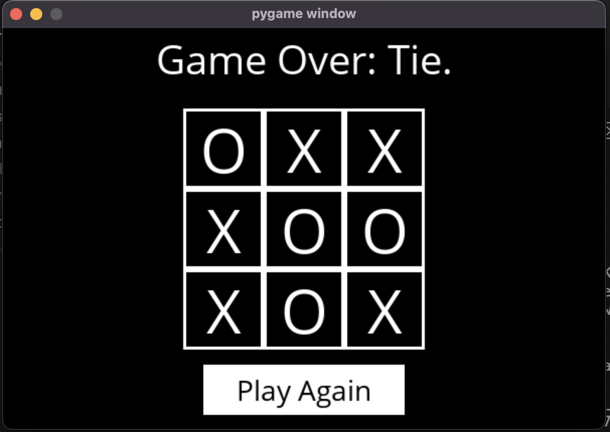

# Tic Tac Toe

Tic Tac Toe made using python, pygame an implementaion of the minimax algorithm

```
git clone https://github.com/pettiboy/tic-tac-toe.git
```

## Usage

```
cd src
pip3 install -r requirements.txt
python3 runner.py
```

## Demo



